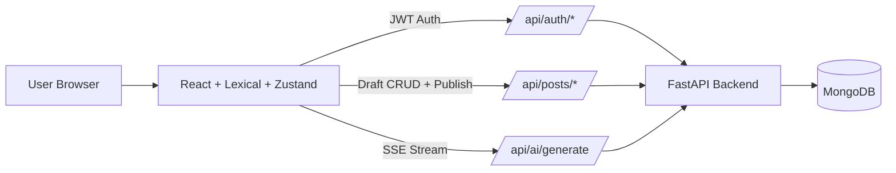

# Architecture - Smart Blog Editor

## 1. System Overview

The project is split into two independent services:

- **frontend/**: React + Lexical + Zustand + Tailwind CSS.
- **backend/**: FastAPI + MongoDB (PyMongo).

The frontend authenticates users with JWT, fetches drafts, edits content in Lexical, and performs debounced auto-save via `PATCH /api/posts/{id}`.



---

## 2. High-Level Design

### Components

1. **Auth Layer**
   - Signup/Login endpoints issue JWT tokens.
   - Frontend stores token in localStorage and injects it in API calls.

2. **Post Service**
   - Handles draft creation, update, listing, and publishing.
   - Stores Lexical serialized state as JSON string to preserve exact block structure.

3. **AI Service**
   - Exposes `POST /api/ai/generate`.
   - Streams chunks as Server-Sent Events (`text/event-stream`) to frontend.

4. **Editor State Layer (Zustand)**
   - Global source of truth for `drafts`, `activePostId`, and `pending` changes.
   - Ensures editor UI and draft sidebar stay synchronized.

---

## 3. Data Model

### User

- `id` (PK)
- `email` (unique)
- `password_hash`
- `created_at`

### Post

- `id` (PK)
- `title`
- `lexical_state` (Text JSON string)
- `text_content` (plain text for AI/search/indexing)
- `status` (`draft | published`)
- `created_at`
- `updated_at`
- `user_id` (FK -> User)

### Why store Lexical JSON instead of HTML

- Lexical is block/tree based; JSON keeps node-level fidelity.
- Rehydration into editor remains lossless.
- HTML conversion can be done later as a derived representation for SEO/rendering.

---

## 4. Frontend LLD

### Key files

- `src/store/authStore.ts`: auth state and token lifecycle.
- `src/store/editorStore.ts`: drafts + pending editor payload + save/publish actions.
- `src/hooks/useDebouncedAutosave.ts`: custom debounce implementation.
- `src/components/BlockEditor.tsx`: Lexical composer/plugins and `onChange` pipeline.
- `src/components/EditorToolbar.tsx`: format commands (bold, italic, heading, lists).
- `src/components/DraftSidebar.tsx`: global draft list + selection.

### State flow

1. Lexical `OnChangePlugin` emits editor state.
2. State converted into:
   - `lexical_state` (serialized node tree)
   - `text_content` (plain text)
3. Zustand `pending` updated.
4. Debounce hook waits 1500 ms of inactivity.
5. `flushSave` sends a single `PATCH` request.

---

## 5. Auto-Save Design

`useDebouncedAutosave` uses a timer-based debounce:

- Every pending change clears the previous timer.
- Save only triggers after no new changes are observed for configured delay.
- This prevents API spam on every keystroke while keeping data fresh.

Complexity characteristics:

- **Time per change event**: `O(1)` timer reset.
- **Network calls**: bounded by user pause frequency, not keystroke count.

---

## 6. API Design

- `POST /api/auth/signup`
- `POST /api/auth/login`
- `POST /api/posts/`
- `GET /api/posts/`
- `PATCH /api/posts/{id}`
- `POST /api/posts/{id}/publish`
- `POST /api/ai/generate` (SSE stream)

---

## 7. File Structure

```text
backend/
  app/
    main.py
    database.py
    models.py
    schemas.py
    security.py
    deps.py
    routers/
      auth.py
      posts.py
      ai.py

frontend/
  src/
    App.tsx
    lib/api.ts
    store/
      authStore.ts
      editorStore.ts
    hooks/
      useDebouncedAutosave.ts
    components/
      AuthForm.tsx
      DraftSidebar.tsx
      EditorToolbar.tsx
      BlockEditor.tsx
```

---

## 8. Production Considerations

- Replace wildcard CORS with explicit origin list.
- Move JWT secret to secure environment manager.
- Add refresh tokens and token revocation strategy.
- Add retry/backoff policy for autosave failures.
- Replace mock AI transformation with provider integration (OpenAI/Gemini).
